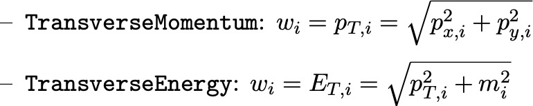
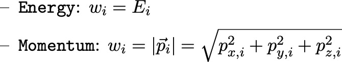
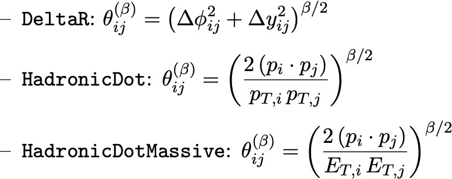
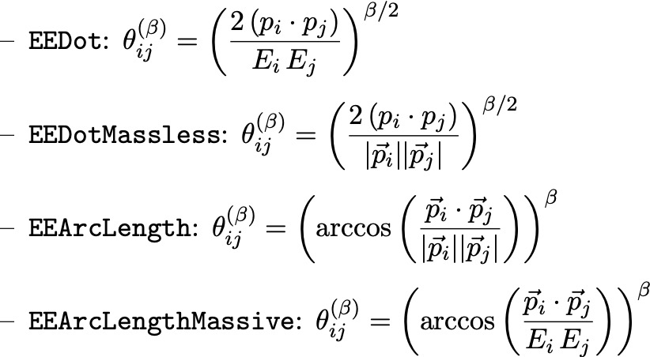

# EventGeometry

EventGeometry is a Python package as well as [FastJet contrib](https://fastjet.hepforge.org/contrib/) written primarily in C++. It incorporates the [Wasserstein](https://pkomiske.github.io/Wasserstein/) package for computing Wasserstein distances (known in particle physics as the Energy Mover's Distance) into the [FastJet](http://fastjet.fr) ecosystem.

## Documentation

The Wasserstein package has good Python and C++ [documentation](https://pkomiske.github.io/Wasserstein/docs/emd/). The main additions of the EventGeometry package are a [`FastJetEvent`](https://github.com/pkomiske/EventGeometry/blob/main/EventGeometry.hh#L123-L183) class that enables events composed either of a `PseudoJet` with constituents, or a vector of PseudoJets that can represent any particles.

### Particle Weights

The EMD requires a notion of "weight" to use for each particle. EventGeometry is quite flexible in this regard, and allows for the following options:

For use primarily with hadronic/pp events:

For use primarily with e+e- events:

For more details, see the [source code](https://github.com/pkomiske/EventGeometry/blob/main/EventGeometry.hh#L186-L237).

### Pairwise Distances

The EMD also requires a notion of distance between particles. EventGeometry supports several options:

For use primarily with hadronic/pp events:

For use primarily with e+e- events:

### Preprocessors

The `EMD` and `PairwiseEMD` classes can preprocess events before computing the Energy Mover's Distance. Available preprocessors include:

- `CenterEScheme`: Computes the E-scheme axis (by adding Cartesian four-momenta) and centers the particles such that the axis is at the origin.
- `CenterPtCentroid`: Computes the pT-weighted centroid of the particles in the rapidity-azimuth plane and centers the particles such that the axis is at the origin.
- `CenterWeightedCentroid`: Computes the weighted centroid axis (according to whatever particle weight is being used) and centers the particles that the axis is at the origin.
- `MaskCircle(Rmax)`: Removes particles from the event that are farther than `Rmax` away from the axis of the event. Note that this generally only makes sense after using one of the previous Preprocessors to center the event so that the axis is defined.

## C++ Usage

The EventGeometry library can be used in header-only mode by including the file `EventGeometry.hh` (note that the path to the `wasserstein` folder should be known to the compiler). If compiling an EventGeometry library is desired, one can run `make shared` (this should work on Linux and MacOS) in order to compile a shared library with appropriate multi-threading capabilities (fully thread-safe even though FastJet may not be). In this case, one should include the line `#define DECLARE_EVENTGEOMETRY_TEMPLATES` prior to including `EventGeometry.hh` and one should also link appropriately with the EventGeometry library.
